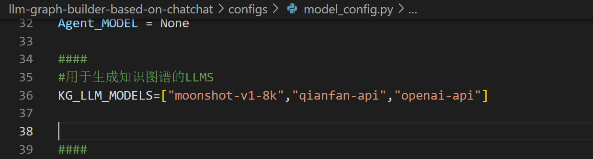
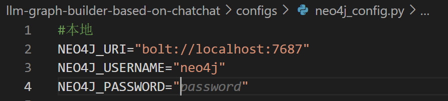
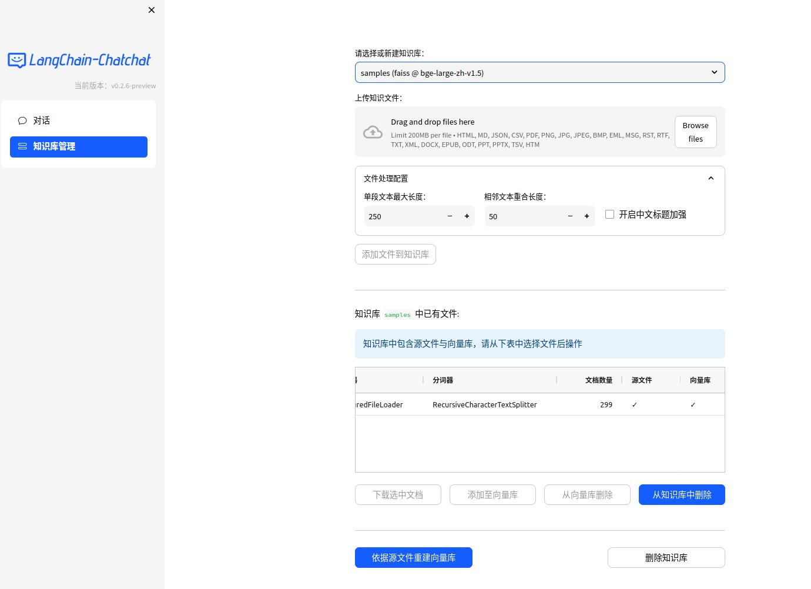
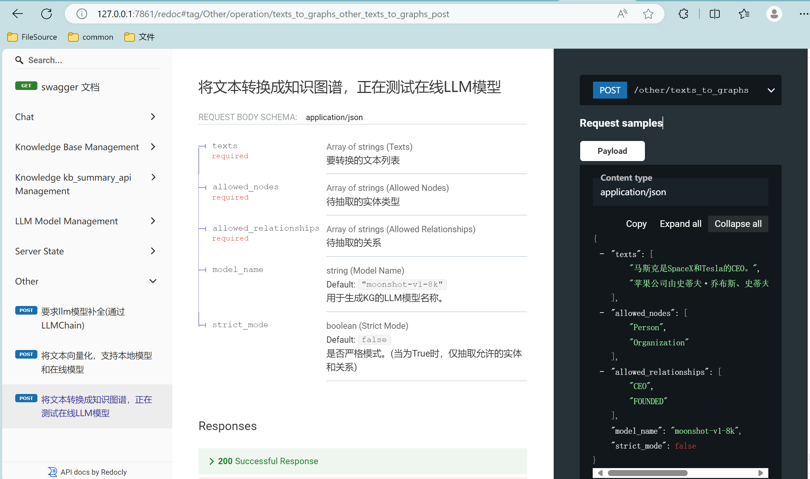
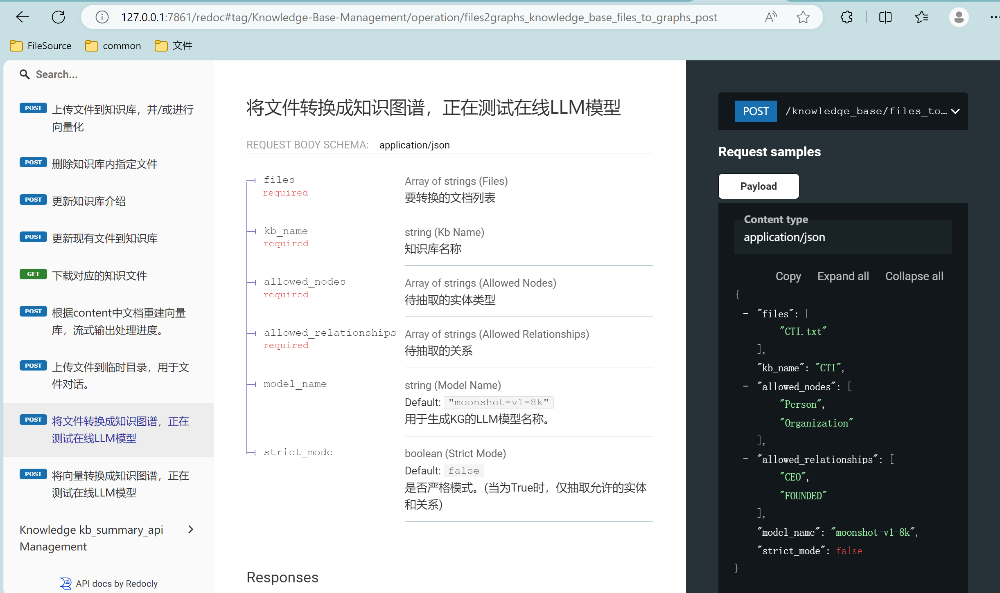
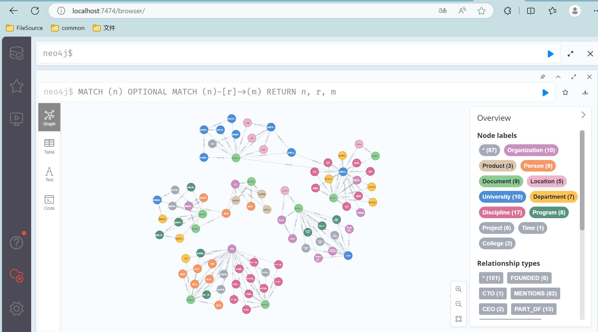
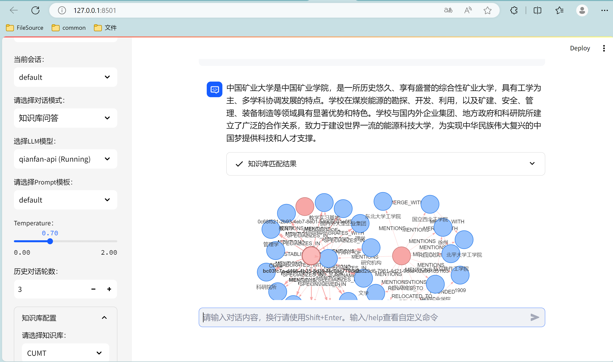

# llm-graph-builder-based-on-chatchat

本项目尝试基于开源项目**[Langchain-Chatchat](https://github.com/chatchat-space/Langchain-Chatchat)**的先前版本[v0.2.10](https://github.com/chatchat-space/Langchain-Chatchat/releases/tag/v0.2.10)，使用llm构建知识图谱并逐步实现图谱的优化修改以及更加灵活图谱问答。

## 1.简单启动

参考原项目的[README](README_chatchat.md)去启动项目,注意新添加配置文件neo4j_config,修改成自己的neo4j数据库，同时model_config中新增配置KG_LLM_MODELS





```shell
python startup.py -a
```

如果正常启动，你将能看到以下界面


1. FastAPI Docs 界面


2. Web UI 启动界面示例：


\- Web UI 对话界面：


\- Web UI 知识库管理页面：




目前以api的形式实现了图谱构建功能：

1.文本多线程转图谱



2.知识库文件或指定文本向量生成知识图谱，并存入neo4j数据库



效果：



此外，使用知识库问答时，采用[streamlit-agraph](https://github.com/ChrisDelClea/streamlit-agraph)展示检索到的图谱：




